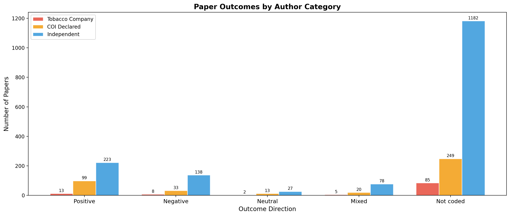
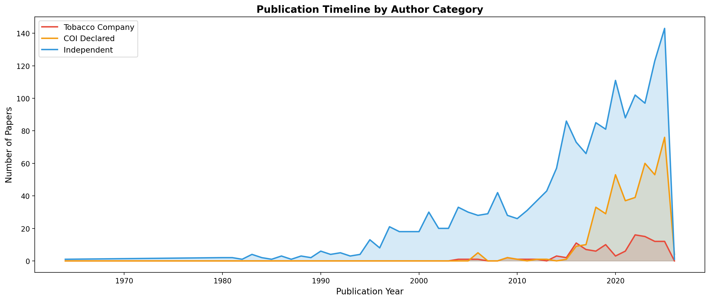
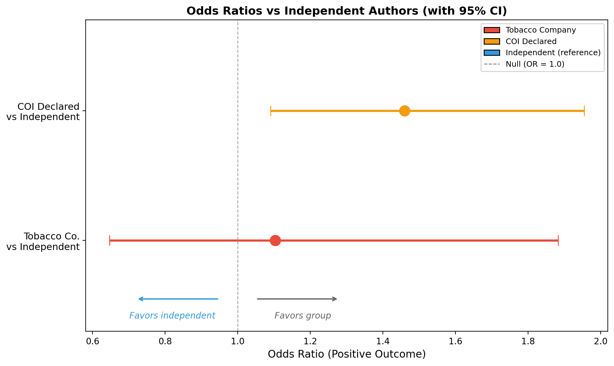
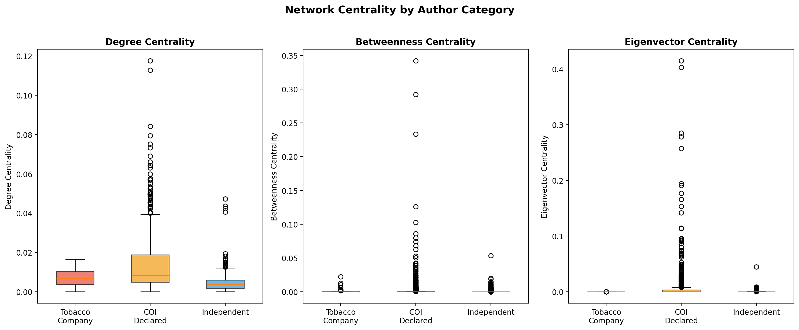
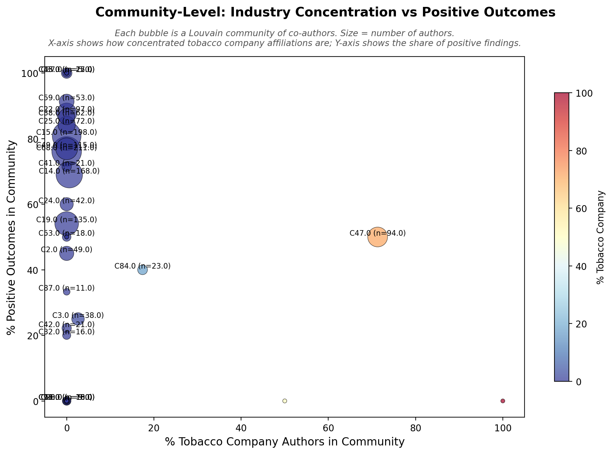

# Part 2: Tobacco/Nicotine Industry Influence — Network Analysis & Visualization

In total, 2,175 tobacco and nicotine research papers published (and sourced on PubMed) between 1964 and 2025 were analyzed. In total, 7,006 authors were identified, and I mapped their co-authorship relationships into a network of 13,405 connections. Papers were classified into three categories based on the nature of their industry ties: **Tobacco Company** (113 papers, 5.2%) where at least one author had a direct affiliation with a known tobacco or nicotine company (e.g., Philip Morris, BAT, JUUL, R.J. Reynolds); **COI Declared** (414 papers, 19.0%) where authors disclosed financial conflicts of interest — such as consulting fees, advisory board membership, or industry funding — but were not directly employed by a tobacco company; and **Independent** (1,648 papers, 75.8%) with no disclosed industry ties. Industry affiliations were identified by matching author affiliations against known tobacco and nicotine companies using pattern-matching, and conflict-of-interest disclosure statements embedded in the publications were classified using keyword detection for phrases like "employee of," "funded by," "consultant," and "advisory board." The co-authorship network exhibits high industry assortativity (0.81), meaning tobacco-affiliated authors form tightly insular clusters, while the most central bridge scientists connecting disparate communities tend to be independent or COI-declaring researchers.

Outcome direction (positive, negative, neutral, or mixed) was determined by extracting conclusion-like sentences from abstracts and classifying them using directional keyword patterns (e.g., "harm reduction," "cessation," "safer" = positive; "carcinogen," "increased risk," "addiction" = negative). Of the 659 papers with codeable outcomes, the most striking finding was a split between the two industry-linked groups. Papers with **direct tobacco company ties showed no significant bias** — their rate of positive outcomes (46.4%) was comparable to independent papers (47.9%), with an odds ratio of 0.83 (p = 0.67). However, **COI-declared papers were twice as likely to report positive outcomes** (60.0% vs 47.9%, OR = 2.01, p < 0.001). This suggests that the bias in tobacco and nicotine research may not originate from researchers directly employed by tobacco companies, but rather from the broader ecosystem of industry-funded consultants, grant recipients, and advisory board members whose financial relationships are disclosed but whose findings nonetheless skew favorably.

---

## What This Analysis Includes

1. **Data Loading & COI Identification** — Ingests 2,175 PubMed records from Part 1, extracts 7,006 unique authors and their affiliations, and classifies each paper into one of three categories: Tobacco Company ties, COI Declared (non-tobacco), or Independent.

2. **Co-Authorship Network Construction** — Builds an undirected weighted graph where nodes are authors and edges represent co-publication. Computes degree, betweenness, closeness, and eigenvector centrality for every author. Detects research communities via Louvain clustering.

3. **Statistical Testing** — Runs tests comparing all three groups: chi-square (3-group), pairwise Fisher exact tests, odds ratios with 95% CI, proportion z-tests, permutation tests, and Kruskal-Wallis + Mann-Whitney U for centrality metrics.

4. **Visualizations** — Generates six static plots (PNG), four interactive charts (HTML), and an interactive co-authorship network with color-coded nodes (three categories) and a legend.

5. **Streamlit Dashboard** — A full interactive dashboard for exploring all results, with filterable paper/author browsers, network views, and outcome charts.

---

## Three-Category Classification

Papers are classified into three mutually exclusive groups:

| Category | Definition | Papers |
|---|---|---|
| **Tobacco Company** | Author has verified affiliation with a known tobacco/nicotine company (Philip Morris, BAT, JUUL, R.J. Reynolds, Altria, etc.) OR the COI statement specifically names a tobacco company | 113 (5.2%) |
| **COI Declared** | Author declared a conflict of interest (pharma consulting, grants, advisory boards, etc.) but NOT tied to a tobacco company | 414 (19.0%) |
| **Independent** | No conflict of interest declared | 1,648 (75.8%) |

---

## Key Results

### Outcome Distribution

| Outcome | Tobacco Company | COI Declared | Independent |
|---|---|---|---|
| Positive | 13 (11.5%) | 99 (23.9%) | 223 (13.5%) |
| Negative | 8 (7.1%) | 33 (8.0%) | 138 (8.4%) |
| Neutral | 2 (1.8%) | 13 (3.1%) | 27 (1.6%) |
| Mixed | 5 (4.4%) | 20 (4.8%) | 78 (4.7%) |
| Not coded | 85 (75.2%) | 249 (60.1%) | 1,182 (71.7%) |

### Statistical Tests

#### Tobacco Company vs Independent

| Test | Statistic | p-value | Interpretation |
|---|---|---|---|
| Odds ratio (Positive) | 0.83 (95% CI: 0.46–1.51) | — | CI spans 1.0 — no significant association |
| Fisher exact | — | 0.668 | No significant difference |
| Proportion z-test | z = −0.61 | 0.541 | 11.5% vs 13.5% positive — not significant |
| Permutation test (two-sided) | — | 0.576 | Consistent with random assignment |

#### COI Declared vs Independent

| Test | Statistic | p-value | Interpretation |
|---|---|---|---|
| Odds ratio (Positive) | **2.01** (95% CI: 1.54–2.62) | — | **Significant: CI does not span 1.0** |
| Fisher exact | — | **< 0.001** | **Significant difference** |
| Proportion z-test | z = 5.20 | **< 0.001** | 23.9% vs 13.5% positive — **significant** |
| Permutation test (two-sided) | — | **< 0.001** | **Not consistent with random assignment** |

#### Overall (3-group)

| Test | Statistic | p-value | Interpretation |
|---|---|---|---|
| Chi-square (coded only, 3×4) | 10.43 | 0.108 | Borderline — not significant at α = 0.05 |

**Bottom line:** Papers with actual **tobacco company ties do not** show significantly more positive outcomes (OR = 0.83, p = 0.67). However, papers where authors **declared a non-tobacco COI** are **2× more likely** to report positive findings (OR = 2.01, p < 0.001). This suggests the positive-outcome signal comes not from tobacco industry influence specifically, but from the broader category of researchers who declare conflicts of interest — potentially reflecting publication norms in industry-adjacent research or funding-related reporting biases that are not tobacco-specific.

### Network Structure

| Metric | Value |
|---|---|
| Connected components | 71 |
| Largest component | 1,470 authors (89.0%) |
| Average degree | 16.24 |
| Transitivity | 0.6258 |
| Louvain communities | 92 |
| **Industry assortativity** | **0.8086** |

The interactive co-authorship network reveals a highly clustered research landscape where 89% of authors belong to a single giant connected component. Tobacco company-affiliated researchers (red diamonds) form tightly insular subgroups — reflected in an industry assortativity coefficient of 0.81 — while COI-declared authors (orange triangles) are more centrally embedded. The most central "bridge" authors connecting disparate research communities — such as Neal Benowitz, Thomas Eissenberg, and Maciej Goniewicz — tend to be COI-declared researchers with high betweenness centrality, while tobacco-affiliated authors sit at the network's periphery with significantly lower eigenvector centrality.

### Centrality Comparison (Kruskal-Wallis + Mann-Whitney U)

| Metric | Tobacco Co. Mean | COI Declared Mean | Independent Mean | KW p-value |
|---|---|---|---|---|
| Degree centrality | 0.0070 | 0.0151 | 0.0044 | **< 0.001** |
| Betweenness centrality | 0.0011 | 0.0036 | 0.0006 | **< 0.001** |
| Closeness centrality | 0.2365 | 0.4152 | 0.2686 | **< 0.001** |
| Eigenvector centrality | 0.000004 | 0.0097 | 0.0005 | **< 0.001** |

---

## Visualizations

### Static Plots

#### Outcome Counts by Author Category


#### Outcome Proportions (%)


#### Publication Timeline by Author Category


#### Odds Ratio Forest Plot


#### Network Centrality by Author Category


#### Community-Level: Industry Concentration vs Positive Outcomes


### Interactive Visualizations (HTML)

Open these files in a browser for full interactivity:

- **[Co-Authorship Network (pyvis)](https://artificialnouveau.github.io/nicotine_analysis/part2/output/viz/coauthor_network_interactive.html)** — Drag, zoom, and hover over the network. Tobacco company authors are red diamonds, COI-declared are orange triangles, independent are blue circles. Node size reflects paper count; edge thickness reflects shared publications.

- **[Co-Authorship Network (plotly)](https://artificialnouveau.github.io/nicotine_analysis/part2/output/viz/coauthor_network_plotly.html)** — Spring-layout network with hover tooltips showing author name, paper count, % positive outcomes, and category.

- **[Sankey Diagram: Author Category to Outcomes](https://artificialnouveau.github.io/nicotine_analysis/part2/output/viz/figures/sankey_funding_outcome.html)** — Flow diagram showing how papers from each category distribute across outcome categories.

- **[Outcome Heatmap Over Time](https://artificialnouveau.github.io/nicotine_analysis/part2/output/viz/figures/outcome_heatmap.html)** — Year-by-year heatmap of % positive outcomes for all three categories from 1990–present.

### Streamlit Dashboard

A full interactive dashboard combining all analyses:

```bash
cd /Users/ahnjili_harmony/Documents/GitHub/nicotine_analysis/part2
streamlit run viz/app.py
```

Then open **http://localhost:8501** in your browser. The dashboard includes:
- Overview with key metrics and statistical findings
- Outcome comparison charts with interactive filters
- Network centrality explorer and community breakdown
- Searchable paper browser
- Searchable author explorer

---

## Project Structure

```
part2/
├── README.md
├── requirements.txt
├── run_pipeline.py                  # Master pipeline (runs all steps)
├── data/
│   └── load_and_identify.py         # Load part1 data, identify COI/industry ties
├── analysis/
│   ├── network.py                   # Build co-authorship network + communities
│   └── statistics.py                # Chi-square, Fisher, OR, permutation tests
├── viz/
│   ├── plots.py                     # Static PNG charts
│   ├── network_viz.py               # Interactive HTML network graphs
│   └── app.py                       # Streamlit dashboard
└── output/
    ├── data/                        # authors.csv, papers.csv, author_papers.csv
    ├── network/                     # GraphML, GEXF, centrality, communities
    ├── stats/                       # full_statistics.json, outcome_comparison.csv
    └── viz/                         # PNG plots + interactive HTML charts
```

## How to Run

```bash
# Install dependencies
pip install -r requirements.txt

# Run the full pipeline (reads from part1 output)
python run_pipeline.py --part1_dir ../part1/study_dump --output_dir ./output

# Launch the dashboard
streamlit run viz/app.py
```

---

## Methods

- **Three-category classification**: Papers are classified as "Tobacco Company" (author has verified affiliation with one of 15 known tobacco/nicotine organizations, or COI statement names a tobacco company), "COI Declared" (author disclosed a conflict of interest that is not tobacco-specific), or "Independent" (no COI declared).
- **Outcome coding**: Conclusion-like sentences are extracted from abstracts, then classified as Positive/Negative/Neutral/Mixed using directional keyword patterns. Neutral patterns (e.g., "no significant") take priority over individual positive/negative signals to prevent misclassification.
- **Network analysis**: Co-authorship graph built with NetworkX; community detection via Louvain algorithm; centrality metrics include degree, betweenness (with inverted weights so stronger ties = shorter paths), closeness, and eigenvector centrality.
- **Statistical tests**: Chi-square test on the 3×4 table (coded outcomes only); pairwise Fisher exact, odds ratio with 95% CI, proportion z-test, and two-sided permutation test (10,000 iterations) for each group vs Independent; Kruskal-Wallis and Mann-Whitney U for centrality comparisons.
